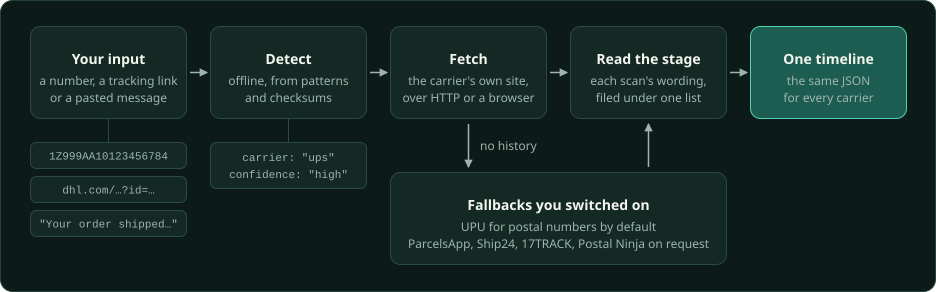

# Architecture

One lookup goes in and one timeline comes out. The package answers a question about a single
parcel and keeps nothing afterwards. Accounts, parcel storage, polling, notifications and any
decision based on an earlier check belong to whoever calls it.

## Where things live

- `core/` holds what every carrier shares: detection, the catalog, the result and status
  model, the error kinds, the step runner and the transports.
- `carriers/<id>/` is one carrier, complete.
- `providers/` holds the universal fallbacks and the rules that order them.
- `facade/` is `createTracker()`. `cli/` and `server/` are thin layers over it.
- `places/` turns the free-text location of a scan into coordinates.
- `generated/` and the catalog in `data/` come out of `npm run generate`. Edit the carrier
  folders, not those files.

## Entry points

- `universal-parcel-scraper` is safe for browsers. It exports catalog data, detection, status
  classification, input validation, result normalization and the provider-order rules, and it
  imports no Node runtime modules.
- `universal-parcel-scraper/node` adds the adapter registry, the transports, the telemetry
  hooks and `createTracker()`.
- `universal-parcel-scraper/places` loads its gazetteer on first use.
  [Its README](places/README.md) explains how a place is chosen.
- `universal-parcel-scraper/data/*` exposes the generated JSON contracts.
- `universal-parcel-scraper/app` holds helpers shaped for the parcel app this package was
  extracted from: its parcel view, the carrier-name hints for provider results, the
  result-clock helpers its sync uses, carrier scan-identity policies, what a carrier's status
  map says about a scan and the country a scan's location names. It imports no Node runtime modules and has no backward-compatibility
  guarantee; coordinate breaking changes with the app. General-purpose tracking and catalog
  helpers belong in the stable entry points, even when the app is their only consumer.

The stable entry points and data schemas follow semver: fixes are patches, additions are
minor, and breaking changes are major. Before 1.0.0, breaking changes raise the minor version.

## Carrier folders

Each carrier owns its catalog document, retrieval, pure parsers, status evidence and
synthetic fixtures, next to a README on how its site is read. Nothing about a carrier lives
outside its folder except the files `npm run generate` derives from it.

Scope follows the service and country, not the brand alone. Separate national services keep
separate ids, and shared number shapes remain ambiguous. A group-wide endpoint matching a
number does not establish a national carrier's ownership. Catalog presence, a dedicated
adapter and successful history retrieval are separate claims in the coverage data.

An adapter is built by a factory that receives an `AdapterEnvironment`. That environment is
its only way to the network, and no framework or app import is allowed. The registry creates
one adapter per process, on first use, so a carrier that fails to load cannot take the others
down with it.

Shared text helpers accept strings and, for scalar codes and identifiers, finite numbers.
Adapters check required payload fields before projecting them; objects and arrays cannot
supply shipment identity, scan text or status codes.

Every adapter passes the caller's signal and budget into each request it makes. An adapter
names its client with the host's `userAgent`, never the runtime's default, and one whose
carrier only answers a browser keeps its own. `testing/adapterContext.test.ts` holds both by
driving every registered adapter and provider against a transport that never answers.
`testing/adapterContextSource.test.ts` checks that each later request and wait takes the
signal too. Lookups that need the local Chromium share one browser, and each waits its turn
inside its own budget.

Browser and image dependencies load only when the step that needs them runs. Packaged
workers, models and geographic data resolve against their own module, never the caller's
working directory.

An adapter declares its steps, for example `direct` then `trawl`.
[runSteps](core/runner/index.ts) runs them in order under one time budget. A later step runs
after a challenge, a transport failure or an inconclusive answer, and never after a definite
one.

## A lookup

`createTracker()` validates the input. A number is four to forty letters and digits and
normally holds a digit. Without one it must be six to ten unbroken letters that a carrier's
detection rule claims, as on a GLS notification card. Such a number is never read out of
pasted text, and the universal providers refuse it.
A number whose shape fits several carriers, or only
identifies an international postal item, is settled by asking the carriers that can recognize
it cheaply. A postal issuer is a lookup candidate, not proof of the delivery carrier.
The tracker then tries the carrier's
dedicated adapter, and after that the fallbacks the caller enabled, in the coverage order.
The `countryHint` input is still accepted but no longer affects a lookup.
One deadline and one cancellation signal cover the whole call. The answer lists every
attempt with its source and outcome.

A failure's kind says what a retry can change. `invalid_input` is a number the carrier does
not issue and `schema` is a reply that was not the expected shape, so neither is worth
repeating at once.

When a result names a delivery partner, the tracker also asks that partner's adapter. Its
answer comes back separately, checked against the number on its own. Adopting it is the
consumer's choice.

Chronopost reads its own credential-free tracking operation, including scans after export
and partner references. La Poste's unified feed can omit that history without a completeness
marker, so its fast success does not replace Chronopost's direct result: La Poste names
Chronopost as the delivery partner of an item the feed marks as Chronopost's. A checked Geopost
reference and explicit German destination propose a DPD Germany confirmation lookup.

Consumers with their own router can call `trackCarrier` from `/node` with an
`AdapterRegistry`, their configured `UniversalTracker` and a `StepRecorder`. It dispatches one
carrier lookup and normalizes the result, and leaves scheduling and provider choice to the
caller. An adapter with `recordsSteps` reports its own lookup, so dispatch does not wrap its
telemetry a second time. `CarrierError.reason` separates expected details, such as Amazon
Shipping's expired history, from transport failures.

USPS barcode validation shares the carrier adapter's whole-identifier checks. A scanned
routing prefix is removed only when it yields one valid package identifier; ambiguous splits
are rejected. A 22-digit PIC whose channel, Mailer ID and check digit agree selects USPS,
apart from the families DHL eCommerce also tracks. Other checksum-valid USPS formats
prioritize a candidate and still require carrier confirmation.

Recognition uses HTTP by default. Consumers can request `recognitionCandidates` with
`phase: 'browser'` after HTTP is inconclusive, then call the adapter's
`recognizeWithBrowser` under a separate budget. The catalog declares eligibility and rank;
recipient inputs exclude a candidate. Browser confirmation requires dated shipment activity
and returns its tracking result for reuse. An ambiguous ten-digit number includes DHL Express among its direct candidates when its waybill check passes. Its
facility clocks are dated where the scan's location settles a zone and stay unresolved
elsewhere; Ship24 relays them with DHL's own offsets.
DHL Express's HTTP path uses its mobile guest API and includes the shared
application bearer. Application settings and authentication failures stay distinct
from a missing waybill; verification failures can recover through its public browser page.
Consumers can ask enabled universal providers during preflight and reuse those results
when saving, while retaining direct confirmation for carrier identity.
Shared tracking portals marked `detectFromNumber` preserve ambiguity when the
number suggests several divisions served by the URL. A country-specific portal
can still identify its own operation.
Consumers bound concurrency, cache answers and
decide when another check is due. `recognizeAll` passes cancellation and its budget to each
callback and discards late answers.
Pass the earlier HTTP error as the browser method's third argument so the adapter retains
its recovery policy, including rate limits and malformed responses.

Callers can order eligible recognition candidates with a `countryHint` and aggregate
`priorities`. A provider's carrier hint and preferred number evidence come first, followed
by the country (home before other served countries), aggregate scores and catalog rank.
These signals do not add candidates, confirm ownership or change how answers are settled.
`recognitionNumberShape` retains only character classes and run lengths for private
aggregate analysis. Keep direct-confirmed live inputs outside Git; repeated observations
of one number do not establish independent evidence.

Some checksums are inferred from public samples. `checksumRejections` names, by their
`carrier.json` ids, the rules whose pattern fit a number but whose checksum failed when
that kept their carrier out of the suggestions. A consumer that later confirms one of those
carriers for the number can count the carrier and rule, without the number, to find a
check that real numbers fail. Where the carrier's adapter applies the same check before any
request, that confirmation cannot happen, so a provider naming that carrier for the number
does not propose it, even when another carrier's high-confidence match kept a low-confidence
rule out of `checksumRejections`.

After building, `node scripts/analyze-recognition.mjs --input <private.jsonl>
--output <private-priorities.json>` reads rows containing `number`, `carrier` and
`confirmation: "direct"`. It discards conflicting labels, reports independent holdout
coverage and emits scores only for shapes with at least twenty distinct confirmations
and carriers with at least five. Its output contains no numbers or prefixes. Consumers
own this evidence and decide when to reload it; it does not alter detection rules.

## Status model

Every scan ends up with one stage from [stages.json](data/stages.json), and `stage_source`
says how it got there:

- A stage the adapter declared from the carrier's own codes wins.
- A scan without one goes through the shared wording classifier in
  [core/status](core/status/wording.ts).
- A scan no rule matches takes the caller's fallback.

Adapters retain `stage_source` when they classify wording before returning a stage.
Explicit carrier vocabularies and provider codes use `carrier_map`; text rules use
`wording:<rule>`, and unmatched text uses `none`. Resolution preserves that source,
including on `pending` events. Universal summaries carry `current_stage_source` from
the event that establishes the current stage. Consumers can review wording and
fallback decisions without mistaking them for explicit maps.

Each carrier's `statuses.json` records the codes and wordings seen from that carrier and the
stage each one means. [CORPUS.md](CORPUS.md) describes those records.

A carrier can declare a `statusMap` next to its map in `status.ts`: the stage its map gives
one provider code and wording, and the codes and wordings it leaves without a stage on
purpose, each with a note. [statusMaps.ts](core/catalog/statusMaps.ts) registers them by
adapter, so Delivengo reads La Poste's. `statusMapAnswer()` in the app entry asks them the
way the app keys the wording it reviews: carrier, provider code, and the wording in
`normalizeStatusWording()` form. It answers `mapped` with the stage, `intentional_gap` with
the note, or `unknown`. A gap without a code covers only wording that came without one, and
a gap without wording covers every wording of its code. The answer reads the code and
wording alone: a stage that depends on the rest of the reply, such as a DPD scan staged by
its enumeration twin, is `unknown`, and so is every scan of a carrier without a declaration.
After a release the app can ask it about every open review entry and close those the map
now stages or leaves out on purpose, under the version it runs.

Some carrier categories cover several milestones. Exact carrier labels refine those cases;
explanatory reasons and future delivery instructions do not establish a new milestone.
A delivery still to come (a forecast, a notice, an instruction or a duty-payment condition:
"will be delivered", "sera livré", "wird morgen zugestellt", "sarà consegnato", "será entregado")
is no scan. The classifier reads only the rest of the sentence, so a notice alone takes the
caller's fallback with `none` and never steps a parcel back to registered.
Customs that cleared or released a parcel puts it back in transit; holds, inspections,
submissions and a clearance still to come or negated stay `customs`. A customs problem is an
`exception`.
Universal providers preserve Posti's handling labels, where registration can record repeated
physical handling rather than electronic pre-advice.

`resolveResult()` exposes an `instant` only for a scan clock with a verified UTC offset.
Local clocks keep their original fields. An adapter puts a clock whose zone the feed does
not establish in `local_time`: a consumer reads an offset-less `time` in the result's zone,
else in the carrier's catalog zone. More rows alone do not prove a fresher or more
complete history.

The app's scan-identity policies let Swiss Post and universal scans gain a location in
place only when a scan retains its instant, wording and known stage and matches uniquely
in both directions. Distinct wording can distinguish scans sharing an instant. Swiss Post
also requires its provider code. Conflicting locations stay separate. Chronopost, DPD France
and Posti scans lose, on the same terms, a stored location their adapter now drops as no place
(a service's name, a status, Posti's "abroad"), and so do universal copies of Posti's scans.
Older apps that cannot compare scan evidence do not use these policies. A policy's
`relabelledFrom` names the zone a source once put on every wall clock: a scan whose wall
clock now carries another offset takes over the row stored under the old label, by provider
code and location.

## Fallback providers

The universal providers answer when no dedicated adapter can. Commercial ones run only when
the caller names them, and UPU is the default. `universalPlan()` orders the eligible providers
from recorded evidence. [providers/COMPARISON.md](providers/COMPARISON.md) explains the
order and [providers/COVERAGE.md](providers/COVERAGE.md) holds the evidence.

## HTTP server

The server adds bounded in-memory caching, duplicate-request sharing, provider spacing,
request limits and optional bearer authentication. It has no database.

A failed lookup is held too, for at least `failureCacheMs` and longer when the upstream or
the carrier's own after-failure interval asks for it. `Retry-After` says when the server will
ask again. A lookup run on a caller's own `budgetMs` is never held. Limits count the socket
address unless `trustedProxies` says how many proxies append to `X-Forwarded-For`.

Its logs carry route names, status codes and durations only. Library consumers connect their
own observability through `StepRecorder`. The routes are in [openapi.json](server/openapi.json).
