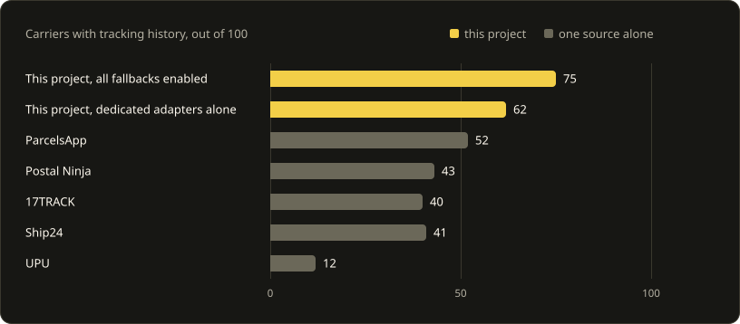
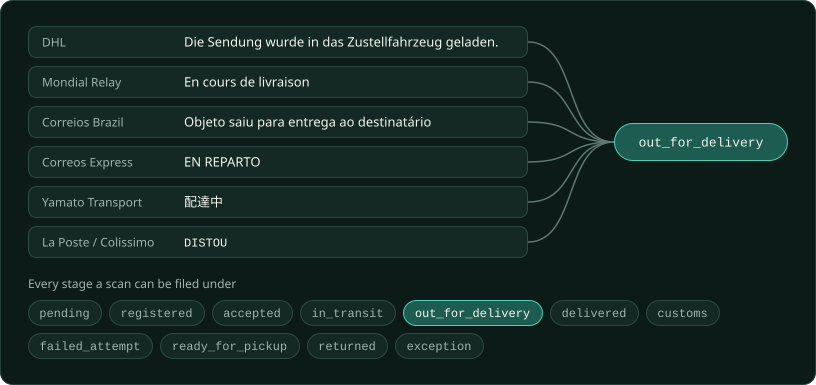

<div align="center">


# Universal Parcel Scraper

**Parcel tracking that asks the carrier directly, from your own machine.**

The engine behind [Peek](https://peektracker.com) ([GitHub](https://github.com/plhery/peek-delivery-tracker)), the open-source parcel tracker for iPhone and the web.

[](https://www.npmjs.com/package/universal-parcel-scraper)
[](https://github.com/plhery/universal-parcel-scraper/actions/workflows/ci.yml)
[](LICENSE)

<!-- GENERATED:summary -->
**3,500+ carriers** through **116 dedicated adapters** and **5 universal fallbacks**

<sub>126 catalog entries · 58 countries represented</sub>
<!-- /GENERATED:summary -->

[Try it](#try-it) · [Ways to run it](#ways-to-run-it) · [Benchmark](#benchmark) · [Carriers](carriers/) · [Add a carrier](CONTRIBUTING.md)



</div>

Give it a tracking number. It finds the carrier, fetches the history from the carrier's own
site and returns the same JSON for every carrier. No account, no API key.

It is the tracking engine of [Peek](https://github.com/plhery/peek-delivery-tracker), usable on
its own as a command, a Node library or an HTTP server.

## Benchmark

<!-- GENERATED:coverage -->
In a curated benchmark of 114 carriers, dedicated adapters return tracking history for **74**, rising to **84** with all fallbacks enabled. The best single aggregator returns 53.


<!-- /GENERATED:coverage -->

[Method and results per carrier](providers/COVERAGE.md)

## Try it

Needs Node.js 24 or newer.

```sh
npx universal-parcel-scraper detect 1Z999AA10123456784    # offline: names the carrier
npx universal-parcel-scraper track YOUR_TRACKING_NUMBER   # asks the carrier
```

Add `--carrier dhl` when a number fits several carriers. Some carriers also want
`--postcode` or `--tracking-url`.

## Ways to run it

### Command line

```sh
npm install -g universal-parcel-scraper
```

```sh
parcel-scraper detect <number, link or text>   # which carrier is this? no network
parcel-scraper track <number>                  # the parcel's history
parcel-scraper recognize <number>              # ask the possible carriers which one knows it
parcel-scraper carriers                        # the catalog, with the ids --carrier accepts
parcel-scraper serve                           # the HTTP API
```

Output is JSON, so it pipes into `jq`. `parcel-scraper --help` lists the environment variables.

### Node

```js
import { createTracker } from 'universal-parcel-scraper/node';

const tracker = createTracker();
const { carrier, source, result } = await tracker.track({ number: process.env.PARCEL_NUMBER });

console.log(carrier, result.current_stage);
for (const scan of result.events) {
  console.log(scan.time, scan.location, scan.description, scan.stage);
}
```

`source` names who answered and `attempts` lists what was tried. With no history, `track()`
throws a `TrackingError` carrying both. [Runnable example](examples/node.mjs).

Besides the scans, `result` carries what the carrier shows about the parcel, such as
`expected_delivery`, `weight_kg`, `destination_country` or the shipping service in
`service_name`.

### Browser

```js
import { parseTrackingInput } from 'universal-parcel-scraper';

parseTrackingInput('1Z999AA10123456784');
// { carrier: 'ups', confidence: 'high', candidates: ['ups'], … }
```

Detection has no Node imports and makes no requests.

### HTTP and Docker

```sh
parcel-scraper serve --port 8080
```

```sh
docker run --rm -p 127.0.0.1:8080:8080 ghcr.io/plhery/universal-parcel-scraper:0.3.0
```

```sh
curl http://127.0.0.1:8080/v1/track \
  -H 'Content-Type: application/json' \
  -d '{"number":"1Z999AA10123456784","carrier":"ups"}'
```

The server caches answers in memory and rate-limits callers. It has no database and never
polls. The image ships Chromium. Routes are in the [OpenAPI file](server/openapi.json) and
settings, such as `SCRAPER_TOKEN` and `SCRAPER_TRUSTED_PROXIES`, in [.env.example](.env.example).

## What you can build with it

- A parcel-tracking app, like [Peek](https://github.com/plhery/peek-delivery-tracker).
- A [Home Assistant sensor](examples/home-assistant.yaml) for the parcel you are waiting on.
- Order status inside a shop or help desk, from any backend that speaks HTTP.
- Tracking numbers pulled out of shipping emails: `detect` reads pasted text and links.
- A cron job that pings you when `current_stage` turns `delivered`.

It answers one lookup at a time. Storing parcels and polling are yours.

## How it works


**Fetching.** Adapters use plain HTTP where the site allows it. For sites that only answer a
browser, install `playwright-core sharp onnxruntime-web` and pass `chromiumPath`, or run the
[TRAWL browser service](trawl/README.md) and pass `trawlUrl`. Pass `userAgent` to name your
install to carriers.

**Fallbacks.** When an adapter finds no history, the lookup moves to the universal trackers
you enabled. When it finds only a current status or its newest scans, the tracker asks them
too and takes a fuller history that is not behind the carrier's. Only UPU is on by default.
Each one you enable receives the tracking number.

```js
createTracker({ providers: ['ParcelsApp', 'Ship24', '17TRACK', 'Postal Ninja', 'UPU'] });
```

**Stages.** Carriers word the same moment differently. Every scan is filed under one stage:

<!-- GENERATED:stages -->


The carrier folders record 3,080 such statuses, each filed under one stage.
<!-- /GENERATED:stages -->

Wording nobody recorded yet goes through a classifier that reads seven European languages.
[ARCHITECTURE.md](ARCHITECTURE.md) has the rest.

## Next to a hosted tracking API

| | Universal Parcel Scraper | Hosted tracking API |
| --- | --- | --- |
| Account | None | Sign-up and an API key |
| Cost | Your own compute | A plan or a per-shipment price |
| Who sees the tracking number | The carrier, plus any fallback you enable | The vendor, then the carrier |
| Updates | You poll | Webhooks |
| When a carrier changes its site | The adapter breaks until it is fixed here | The vendor deals with it |

## Privacy and limits

- A lookup sends the number to the carrier, with the postcode or tracking link when the
  carrier requires one. Enabled fallbacks receive the number too.
- No telemetry. Server logs hold route names and outcomes, never parcel inputs.
- This is scraping: carriers change their sites and turn away automated requests. Keep to the
  catalog's refresh limits and to the retry advice in errors.
- A scan time with no known UTC offset is returned as the carrier wrote it.

## Contributing

Each carrier lives in its own folder with synthetic fixtures and offline tests.
`npm run carrier:new` scaffolds a new one. See [CONTRIBUTING.md](CONTRIBUTING.md) and
[SECURITY.md](SECURITY.md).

## License

[Apache-2.0](LICENSE). The optional TRAWL image is [AGPL-3.0](trawl/LICENSE). Credits are in
[NOTICE](NOTICE).
