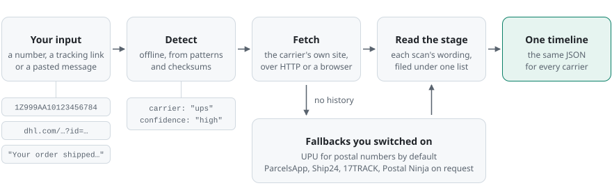
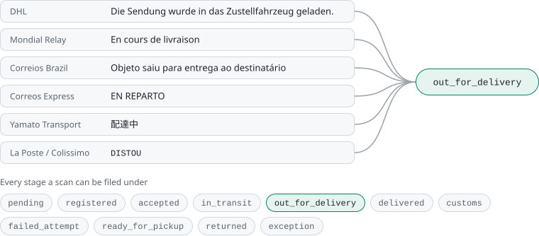
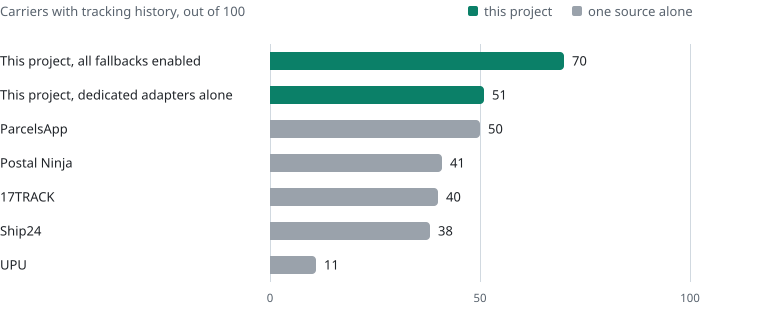

<div align="center">


# Universal Parcel Scraper

**Parcel tracking that asks the carrier directly, from your own machine.**

The engine behind [Peek](https://github.com/plhery/delivery-tracker), the open-source parcel tracker for iPhone and the web.

[](https://www.npmjs.com/package/universal-parcel-scraper)
[](https://github.com/plhery/universal-parcel-scraper/actions/workflows/ci.yml)
[](LICENSE)

<!-- GENERATED:summary -->
**3,500+ carriers** through **85 dedicated adapters** and **5 universal fallbacks**

<sub>105 carriers in the catalog · 58 countries represented</sub>
<!-- /GENERATED:summary -->

[Try it](#try-it) · [Ways to run it](#ways-to-run-it) · [Coverage](#how-much-can-it-track) · [Carriers](carriers/) · [Add a carrier](CONTRIBUTING.md)


</div>

Give it a tracking number. It works out which carrier the number belongs to and fetches the
history from that carrier's own website. What comes back has one shape, so a UPS parcel and
a Poczta Polska parcel look the same to your code.

There is no account to open and no API key. The carriers it knows best each have a dedicated
adapter in [their own folder](carriers/), with a README on how that site is read. For the
rest it can ask the universal trackers such as 17TRACK and Ship24, which is where the big
number above comes from. Those stay off until you switch them on, and each one you enable
sees the numbers you send it.

It started as the tracking engine inside [Peek](https://github.com/plhery/delivery-tracker)
and was pulled out so it can be used on its own. It runs as a command-line tool and as a Node
library, and it can serve the same lookups over HTTP.

## Try it

You need Node.js 24 or newer.

```sh
npx universal-parcel-scraper detect 1Z999AA10123456784
```

Detection is offline. It checks the number against each carrier's formats and checksums and
answers `ups` without sending anything anywhere.

```sh
npx universal-parcel-scraper track YOUR_TRACKING_NUMBER
```

Tracking does go out, to the carrier that owns the number. If a number fits several carriers,
name one with `--carrier dhl`. A few carriers also want the delivery postcode (`--postcode`)
or the link from the shipping email (`--tracking-url`).

## Ways to run it

### Command line

```sh
npm install -g universal-parcel-scraper
```

The command is `parcel-scraper`:

```sh
parcel-scraper detect <number, link or text>   # which carrier is this? no network
parcel-scraper track <number>                  # the parcel's history
parcel-scraper recognize <number>              # ask the possible carriers which one knows it
parcel-scraper carriers                        # the catalog, with the ids --carrier accepts
parcel-scraper serve                           # the HTTP API described below
```

Everything prints JSON, so it pipes:

```sh
parcel-scraper track "$NUMBER" | jq -r '.result.current_stage'
```

`parcel-scraper --help` lists the environment variables.

### Node

```js
import { createTracker } from 'universal-parcel-scraper/node';

const tracker = createTracker();
const { carrier, source, result } = await tracker.track({ number: process.env.PARCEL_NUMBER });

console.log(carrier, result.current_stage);
for (const scan of result.events) {
  console.log(scan.time, scan.location, scan.description, scan.stage);
}
```

Each scan keeps the carrier's wording and gains a `stage` from [one shared list](data/stages.json).
`source` names who answered, and `attempts` lists everything that was tried. When nothing
returns a history, `track()` throws a `TrackingError` carrying those attempts and a hint about
the cause. [examples/node.mjs](examples/node.mjs) is a runnable version.

### Browser

```js
import { parseTrackingInput } from 'universal-parcel-scraper';

parseTrackingInput('1Z999AA10123456784');
// { carrier: 'ups', confidence: 'high', candidates: ['ups'], … }
```

The root import has no Node imports and makes no requests, so it can sit behind a form field
and name the carrier as someone types.

### HTTP

For anything that is not JavaScript:

```sh
parcel-scraper serve --port 8080
```

```sh
curl http://127.0.0.1:8080/v1/track \
  -H 'Content-Type: application/json' \
  -d '{"number":"1Z999AA10123456784","carrier":"ups"}'
```

`/v1/detect`, `/v1/recognize` and `/v1/carriers` sit next to it, and the
[OpenAPI file](server/openapi.json) describes them all. The server caches recent answers in
memory and rate-limits callers. It has no database and never polls on its own.

Set `SCRAPER_TOKEN` to require a bearer token. `SCRAPER_DEMO_PAGE=true` serves a small page
at `/` for trying numbers by hand. Behind a reverse proxy, set `SCRAPER_TRUSTED_PROXIES` so
the rate limit counts each caller and not the proxy. The other settings are in
[.env.example](.env.example).

### Docker

```sh
docker run --rm -p 127.0.0.1:8080:8080 ghcr.io/plhery/universal-parcel-scraper:0.3.0
```

The image runs `serve` and ships Chromium, for the carriers that only answer a real browser.

## What you can build with it

- **A parcel-tracking app.** [Peek](https://github.com/plhery/delivery-tracker) is the
  full-size example: an iPhone and web app built on this package.
- **A Home Assistant sensor** for the parcel you are waiting on.
  [The config is in examples](examples/home-assistant.yaml).
- **Order status inside a shop or help desk**, so customers are not sent off to the carrier's
  site. Any backend that speaks HTTP can call the server.
- **Tracking numbers pulled out of shipping emails.** `detect` takes pasted text and carrier
  links as well as bare numbers.
- **A carrier field that fills itself in**, with the browser import.
- **A cron job** that pings you when `current_stage` turns `delivered`.

The library answers one lookup at a time. Storing parcels and deciding when to check again
are yours to do.

## How it works

<picture>
  <source media="(prefers-color-scheme: dark)" srcset="docs/assets/how-it-works-dark.svg">
  
</picture>

Each adapter uses plain HTTP wherever the carrier's site allows it. Some sites only answer a
real browser and others need image processing, so those adapters can drive a local Chromium
or the optional [TRAWL browser service](trawl/README.md). Install what your carriers need:

```sh
npm install playwright-core sharp onnxruntime-web
```

Then pass `chromiumPath` or `trawlUrl` to `createTracker()`. The CLI and the server read
`TRACKING_CHROMIUM_PATH` and `FLARESOLVERR_URL`.

Where a carrier accepts a plain client, the adapter names itself with the package's default
User-Agent. Pass `userAgent`, or set `SCRAPER_USER_AGENT`, to send your own.

When the adapter finds no history, the lookup can move on to an aggregator. Only UPU is on
by default, for the postal numbers it can serve. The commercial ones are opt-in, and each
one you enable receives the tracking number:

```js
createTracker({ providers: ['ParcelsApp', 'Ship24', '17TRACK', 'Postal Ninja', 'UPU'] });
```

### One stage list

Carriers describe the same moment in their own words, or with a bare code. Each carrier
folder keeps a `statuses.json` with the codes and wordings seen from that carrier and the
stage each one means. Every entry also says how it was confirmed, by a live reply or the
carrier's own documentation for instance.

<!-- GENERATED:stages -->
<picture>
  <source media="(prefers-color-scheme: dark)" srcset="docs/assets/stages-dark.svg">
  
</picture>

The folders hold 1,671 recorded statuses from 88 carriers.
<!-- /GENERATED:stages -->

A scan nobody has recorded yet goes through a shared classifier that reads English, French,
German, Italian, Spanish, Portuguese and Polish. Each scan in the result carries a
`stage_source` saying which of the two decided.

[ARCHITECTURE.md](ARCHITECTURE.md) has the rest.

## How much can it track?

The number at the top of this page is reach: with the fallbacks on, a lookup can go to the
largest aggregator, and [reach.json](docs/reach.json) records how many carriers each one
says it follows. Whether a real parcel comes back with its history is a different question,
so each source was run on its own against the same **100-carrier reference set**. The top
bar counts a carrier when any source below it returned a history.

<!-- GENERATED:coverage -->
<picture>
  <source media="(prefers-color-scheme: dark)" srcset="docs/assets/coverage-dark.svg">
  
</picture>

<details>
<summary>The same numbers as a table</summary>

| Source | Carriers with history |
| --- | ---: |
| **Universal Parcel Scraper, all fallbacks enabled** | **70 / 100** |
| Dedicated adapters alone | 51 / 100 |
| ParcelsApp | 50 / 100 |
| Postal Ninja | 41 / 100 |
| 17TRACK | 40 / 100 |
| Ship24 | 38 / 100 |
| UPU | 11 / 100 |

</details>
<!-- /GENERATED:coverage -->

The numbers come from [coverage.json](providers/coverage.json): the recorded outcome for each
carrier's comparison reference, partial histories included and alternate samples left out.
The set is curated. Read it as a comparison between sources, not as a market-share ranking
or a promise about today, because parcels expire and carrier sites change.
[Carrier-by-carrier results and limitations](providers/COVERAGE.md).

## Next to a hosted tracking API

| | Universal Parcel Scraper | Hosted tracking API |
| --- | --- | --- |
| Account | None | Sign-up and an API key |
| Cost | Your own compute | A plan or a per-shipment price |
| Who sees the tracking number | The carrier, plus any fallback you enable | The vendor, then the carrier |
| Carriers | Dedicated adapters for the [catalog](carriers/), fallbacks for the rest | One large catalog |
| Updates | You poll | Webhooks |
| When a carrier changes its site | The adapter breaks until it is fixed here | The vendor deals with it |
| Hosting | Yours | Theirs |

If you want webhooks and nothing to run, a hosted API is the better choice. This project is
for when the numbers should stay on your side, or when a price per parcel makes no sense for
what you are building. Vendor catalog totals are not comparable with the reference test
above.

## Privacy and limits

A lookup sends the tracking number to the carrier, along with the postcode or tracking link
when that carrier requires one. Fallbacks you enabled receive the number too, and ParcelsApp
also gets a postcode if you supplied it. Pages opened in a browser, locally or through TRAWL,
can load the carrier's or provider's challenge scripts. The library has no telemetry, and
the server's logs hold route names and outcomes, never parcel inputs.

This is scraping, so things break. Carriers redesign their sites and turn away automated
requests. A few need more than the number, such as a postcode or the link from the shipping
email, and the ones that require an account stay limited. Keep to the catalog's refresh
limits and to the retry advice that comes with an error. A scan time with no known UTC offset
is returned as the carrier wrote it, with no zone guessed.

## Contributing

Adapters break when carriers change their sites. Each carrier lives in its own folder with
synthetic fixtures and offline tests, so a fix stays local to that folder. For a new carrier,
`npm run carrier:new` scaffolds the folder and [CONTRIBUTING.md](CONTRIBUTING.md) covers the
rest. Report security issues through [SECURITY.md](SECURITY.md).

## License

The core is [Apache-2.0](LICENSE). The optional TRAWL image is a derivative under
[AGPL-3.0](trawl/LICENSE). Data and model credits are in [NOTICE](NOTICE).
